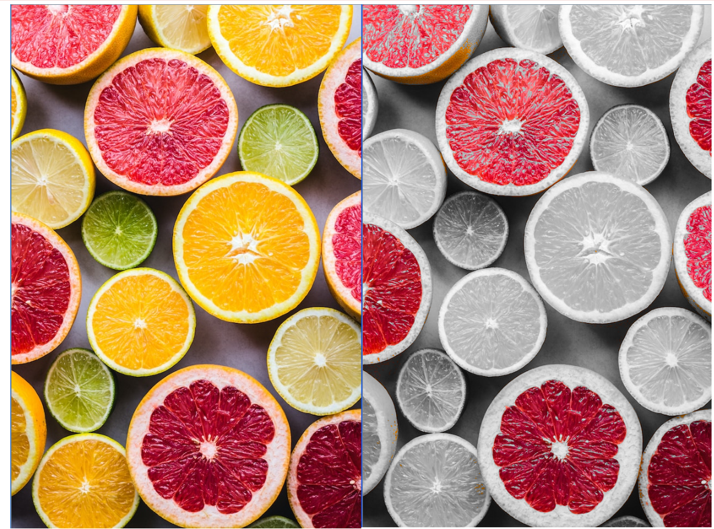

# ScalaShop: Image Processing and Parallelization Lab

This repository contains my implementation of various image processing filters and parallelization techniques as part of a lab assignment. The lab focused on designing an interface to apply simple filters to images, exploring encapsulation behind functional interfaces, and parallelizing the implementation for scalability.




## Overview

The project involves implementing several image filters in Scala, including:

- **Grayscale Filter**: Transforms an image into grayscale by computing the luma of each pixel using the Rec 601 standard.
- **Red Splash Filter**: Applies a grayscale filter to the image but leaves bright red pixels in color, creating a color splash effect.
- **Simple Blur (Box Blur)**: Blurs the image by averaging the pixels within a specified radius, using a box-blur algorithm.
- **Gaussian Blur**: Implements a blur using a weighted kernel to produce a softer blurring effect.
- **Convolution Filters**: Generalizes the blur operation using convolution with arbitrary kernels, allowing for more complex filters like the Gaussian blur.
- **Sobel Edge Detection (Senior Track)**: Implements edge detection by calculating gradients using the Sobel operator.

In addition to implementing the filters, I parallelized the image processing to improve performance on large images. This involved modifying the build process to compute image sections in parallel, utilizing Scala's parallel collections and controlling the level of parallelism.

## What I Did

- **Implemented Filters**: Completed the skeleton code for various image filters, including the grayscale, red splash, simple blur, and convolution-based filters.
- **Parallelization**: Developed a parallel image building process by dividing the image into sections and processing them concurrently. This improves performance, especially on high-resolution images.
- **Explored Convolutions**: Learned how convolution operations can be used to implement complex image filters and effects.
- **Edge Detection**: *(Optional Senior Track)* Reimplemented the Sobel edge detection filter from scratch, understanding how gradient calculations can detect edges in images.

## What I Learned

- **Functional Interfaces**: Gained experience in designing and using functional interfaces to simplify code and make it more modular.
- **Image Processing Concepts**: Learned about image representations, pixel manipulations, and how filters like blur and edge detection work.
- **Convolutions and Kernels**: Understood how convolution operations with kernels can be used to apply various effects to images.
- **Parallel Computing**: Explored how to parallelize computations in Scala, managing tasks, and optimizing performance based on available resources.
- **Performance Considerations**: Discovered the trade-offs in parallelization, such as overhead versus performance gains, and how to balance them.

## How to Run

To run the ScalaShop application:

1. **Clone the repository**:

   ```bash
   git clone https://github.com/yourusername/scalashop.git

2. **Navigate to the project directory:**:

   ```bash
   git clone https://github.com/yourusername/scalashop.git

3. **Run the application using SBT:**:

   ```bash
   sbt run
